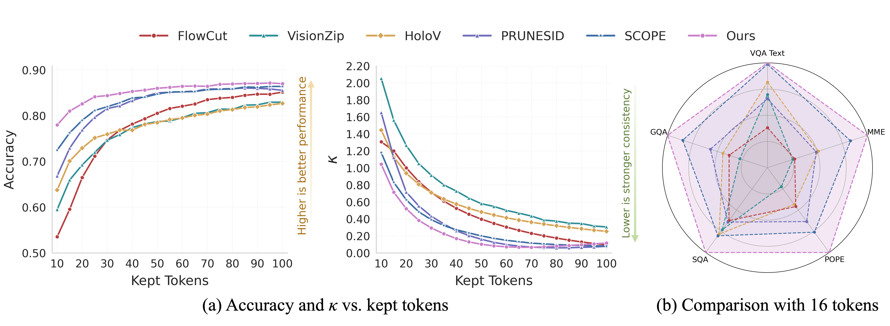
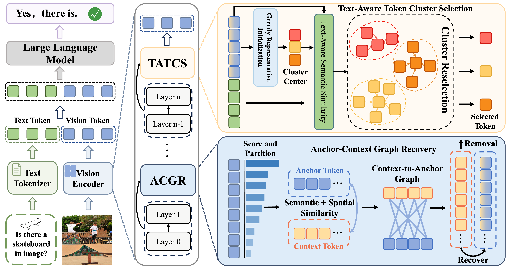
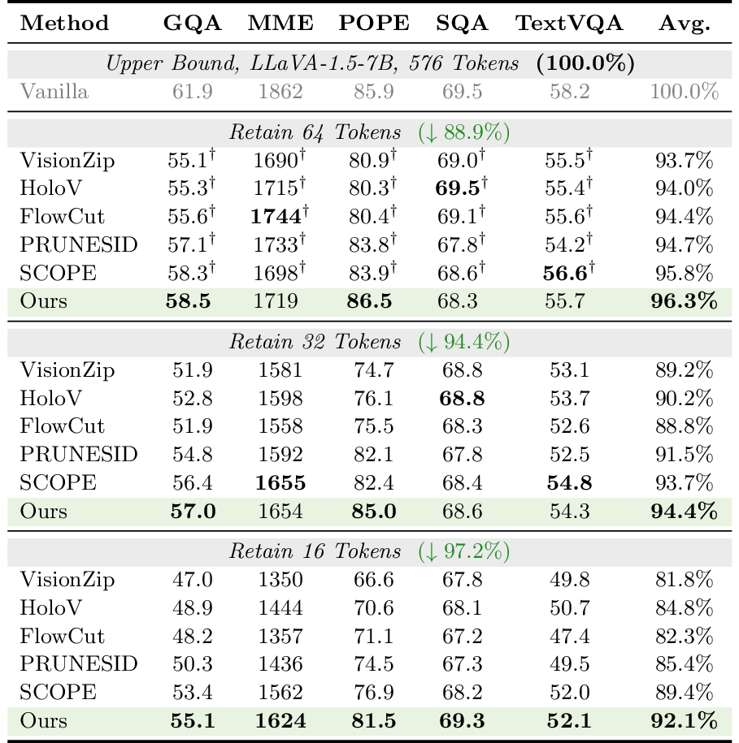
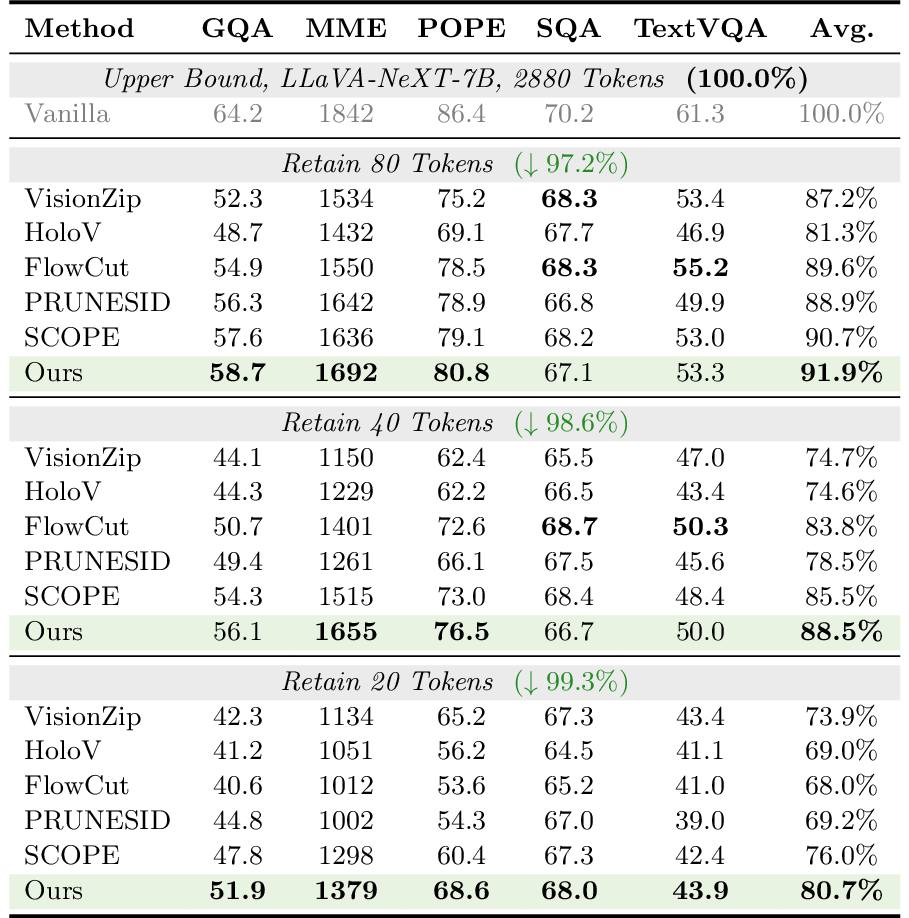

# DCP-Prune: Ultra-Low Token Pruning with Distribution Consistency Preservation

> **Abstract:** Recent vision token pruning methods can preserve performance well under moderate token budgets, but often become unstable under ultra-low token budgets. We observe that as the pruning budget decreases, downstream accuracy degradation is consistently accompanied by larger feature distribution shifts between retained and full visual tokens. Based on this observation, we introduce a lightweight distribution consistency metric and propose **DCP-Prune**, a two-stage framework for ultra-low visual token pruning. Our method combines **Anchor-Context Graph Recovery (ACGR)** to transfer contextual information before token removal and **Text-Aware Token Cluster Selection (TATCS)** to re-select representative tokens when severe distribution drift is detected. Extensive experiments show that DCP-Prune achieves stronger and more stable performance under aggressive compression, retaining **92.1%** of the upper-bound average performance on **LLaVA-1.5-7B** with only **16 visual tokens**.

---

## ✨ Highlights

* 📉 **Distribution Shift Matters**: Ultra-low token pruning causes a clear mismatch between retained and full visual token distributions, which strongly correlates with performance degradation.
* 🧩 **Context Before Removal**: **ACGR** transfers complementary context from discarded tokens to retained tokens to reduce semantic loss under aggressive pruning.
* 🎯 **Representative Token Reselection**: **TATCS** uses text-aware token reselection when severe distribution drift appears, helping preserve task-relevant visual evidence.
* 🚀 **Strong Ultra-Low Performance**: On **LLaVA-1.5-7B**, DCP-Prune still retains **92.1%** of the upper-bound average performance with only **16 visual tokens**, corresponding to a **97.2% token reduction**.

---

## 🔍 Overview

### Distribution Consistency under Ultra-Low Token Budgets

<p align="center">
  
</p>

Figure **(a)** shows that lower token budgets lead to larger **κ**, indicating more severe distribution mismatch and lower accuracy.

Figure **(b)** highlights the strong performance of **DCP-Prune** under the ultra-low token regime, showing clear advantages over existing pruning methods.

### How DCP-Prune works

<p align="center">
  
</p>

DCP-Prune is a two-stage framework designed for aggressive token compression. **ACGR** enriches retained tokens with contextual information before pruning, while **TATCS** re-selects representative visual tokens with text-aware guidance when severe distribution drift is detected. Together, they help keep the retained token set both compact and representative.

---

## 📊 Results

### Results on LLaVA-1.5-7B and LLaVA-NeXT-7B

DCP-Prune achieves strong and stable performance under the **ultra-low** token regime on both **LLaVA-1.5-7B** and **LLaVA-NeXT-7B**.

<p align="center">
  
  
</p>

### Visualization of Selected Tokens

The visualizations below show that DCP-Prune preserves a more representative subset of visual tokens under aggressive compression.

<p align="center">
  
</p>

<p align="center">
  
</p>

---

## 📚 Citation

If you find this work useful, please consider citing:

```bibtex
@article{xue2026dcpprune,
  title={DCP-Prune: Ultra-Low Token Pruning with Distribution Consistency Preservation},
  author={Xue, Xifeng and Wang, Xiaokang and Li, Zirui and Cheng, Ming-Ming and Sun, Guolei},
  journal={arXiv preprint arXiv:2606.16633},
  year={2026}
}
```
